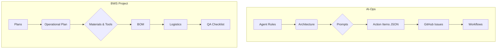

# Dependency Graph

This document will contain Mermaid diagrams illustrating dependencies for AI-Ops and BWS projects.

```mermaid
graph TD
    subgraph AI-Ops
        A[Agent Rules] --> B(Architecture)
        B --> C{Prompts}
        C --> D[Action Items JSON]
        D --> E[GitHub Issues]
        E --> F[Workflows]
    end

    subgraph BWS Project
        G[Plans] --> H(Operational Plan)
        H --> I{Materials & Tools}
        I --> J[BOM]
        J --> K[Logistics]
        K --> L[QA Checklist]
    end
```
