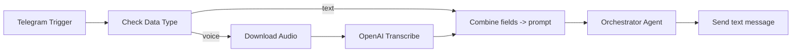

# AI-Ops Model

This document outlines the architecture, roles, memory, tools, and Blocking Question policies for the AI agent.

## Agent Rules

The core operational rules for the AI agent are defined in `files/agent_config/agent_rules.md`. The duplicated `agent_rules.md` in the root directory will be removed.

### Key Rules:
- **Prompt Usage**: Always use prompts from `agent_config/prompts/`.
- **Output Location**: Place results in `data/` and tasks in `project/tasks.md`.
- **Action Item Conversion**: Use `action_items_to_json.md` for converting action items to JSON.
- **Project Updates**: Update `project/plan.md` and `docs/README.md` after each new task or project change.
- **Language Model Selection**:
    - Data Extraction (tables): Claude, GPT-4, Llama3-70B, Bielik-7B (for Polish).
    - Summaries/Text Generation (Polish): Bielik, Llama3-70B, Command R+.
    - Coding: GPT-4, Claude Opus, Llama3-70B-Code.
- **Workflow Changes**: Major workflow changes should be documented in `project/architecture.md`.

## Personal Assistant Architecture Overview

The Personal Assistant is an n8n-based system designed for orchestrating various AI agents.

### High-Level Components and Data Flow:
- **I/O Orchestration**: Telegram is the primary interface. Messages (text/voice) are processed, voice messages transcribed, and combined into a single `prompt`. An `Orchestrator Agent` decides which domain-specific agent/tool to call and responds back to Telegram.
- **Memory**: Short chat buffer and Postgres-based chat memory provide session context using Telegram `chat.id` as `sessionKey`.
- **Models**: Anthropic, OpenAI, and Perplexity models are available and connected to specific agents/tools.
- **Domain Agents**: Specialized agents for Research, Content Creation, Email, Calendar, Contacts, Weather/News, Finance Tracking, Travel, Social Media Calendar, and Document Creator/Reporting.

### Global Data Flow:

## Orchestrator Agent

**Purpose**: Central router that reads the combined `prompt`, applies a comprehensive system message with domain-specific instructions, and delegates to the appropriate agent/tool.

**Key Principles (from System Message)**:
- Weather/News: Call Weather/News agent. Output limited (temperature, wind, precipitation, sunrise/sunset on request). News: latest headlines + summary.
- Travel: Use Flights/Hotels agent. Defaults: economy, one-way, major city airports, fewest layovers.
- Email: Full management; confirm drafts before sending; search addresses via Contacts if missing.
- Expenses: Use Finance Tracking; input format: currency, amount, type; date as ISO 8601.
- Deep Research: Use Research agent (Tavily + Perplexity); escalate to deep research if required.
- Calendar: Manage meetings via Calendar agent; resolve contacts via Contacts agent.
- Social Media Calendar: Get ideas via Airtable and update selected framework and status.
- Content Writing: Create long article with research and image generation, then create Google Doc and return shareable URL.

**Inputs**: `prompt =` Telegram text + optional transcription.
**Outputs**: Final text response back to Telegram.
**Dependencies**: Connected to all domain-specific agents/tools; uses both memory nodes for context.

## Memory Management

- `Simple Memory` (BufferWindow): Session: `Telegram Trigger chat.id`, context window: 10 messages.
- `Postgres Chat Memory`: Session: `Telegram Trigger chat.id`, context window: 7 messages.

## Language Models

- `Anthropic Chat Model` (e.g., Claude Sonnet)
- `GPT-4.1`, `gpt-4.1-mini` (named `GPT-5-Nano` in workflow)
- Perplexity Models: `sonar-pro`, `sonar-deep-research`

## Domain Agents and Tools

- **Weather and News**: Lightweight agent with WeatherAPI and SERPapi news tools.
- **Research Assistant**: General and deep research using Tavily Research and Perplexity models.
- **Content Creation Agent**: Generates SEO blog posts using various sub-agents and tools (Replicate for image generation).
- **Email Agent**: Comprehensive Gmail management (get, send, reply, delete, labels).
- **Calendar Agent**: Manages Google Calendar (create, update, get, delete events).
- **Contacts Agent**: Searches contact details via Google Contacts.
- **Finance Tracking**: Adds/searches expenses in Airtable.
- **Travel Agent**: Finds flights and hotels using SERP APIs.
- **Social Media Calendar (Content Planner)**: Manages content ideas in Airtable for Instagram, LinkedIn, TikTok.
- **Document Creator and Reporting**: Manages Google Docs for content output and reporting.

## Personal Assistant JSON Configuration

The `Personal Assistant.json` workflow definition file confirms the architectural details. It explicitly defines the `Orchestrator Agent` and its connections to various domain-specific agents (e.g., "Research Agent", "Weather and News Agent", "Finance Tracker Agent"). The JSON also specifies the underlying tools used by these agents, such as "Tavily Research", "Message a model in Perplexity", "SERPapi news", and "AirtableTool". It details the integration of multiple language models including "Anthropic Chat Model" and "GPT-5-Nano" (mapping to `gpt-4.1-mini`). Memory configurations, specifically "Simple Memory" (BufferWindow) and its session key, are also present, aligning with the architectural overview.

## Modification Playbooks

### Add a new tool to an existing agent:
1. Create tool node with a concise `toolDescription`.
2. Connect required `$fromAI(...)` inputs with safe defaults.
3. Connect tool to target agent in `connections`.
4. If tool calls external API, create dedicated n8n credential.
5. Update agent's system message to describe when to use the new tool.

### Add a new domain agent:
1. Create `agentTool` node with clear system message and inputs.
2. Attach chat model if needed.
3. Add one or more tool nodes, connect them to the agent.
4. Connect agent to `Orchestrator Agent` and update its system message routing policy.

### Customize memory:
1. Adjust `contextWindowLength` on memory node.
2. Ensure `sessionKey` remains `Telegram chat.id` unless multi-channel support is added.

## Policies

### Blocking Questions
- If information is contradictory or insufficient to complete a task, create a Blocking Question with exact citation/source.
- Block the creation of the actual Issue (only Draft) until an answer is provided.
- Generated Blocking Questions should be precise (1-3 questions per topic) with options for resolution.

### Output Artifacts
- All output artifacts should be saved in the repo:
    - `/action_items/scopeA_YYYYMMDD.json`
    - `/action_items/scopeB_YYYYMMDD.json`
- Update `/docs/project_summary.md` and `/docs/changelog.md`.

### File Conversion (from promptMASTER.md)
- Binary files (PDF/PNG/ZIP) should be parsed via OCR/conversion to MD (to `/docs/_converted/`), preserving a link to the original.

## Unprocessed/Problematic Files

### `pdf-ai-agent-army.txt` (Converted from `ai agent army in n8n.pdf`)

This file, originally `ai agent army in n8n.pdf`, was attempted to be converted to text, resulting in `pdf-ai-agent-army.txt`. However, the conversion was unsuccessful, yielding only control characters. This is likely due to the original PDF being image-based and lacking an embedded text layer. Therefore, no meaningful content could be extracted from this file for `kb/ops_model.md`.

### AI Project Management Agent

This document (`AI_Project_Management (1).md`) describes a project management agent that functions similarly to a project manager in Asana. Key takeaways for the AI-Ops model include:

- **Capabilities**: Creates projects, tasks, and sub-tasks based on chat commands.
- **Mechanism**: Utilizes an `Agent Project Manager` to understand requests and `Simple Memory` to retain conversation context. The `Think` node assists in processing complex instructions.
- **Integration**: Designed to work with n8n workflows, specifically using an Asana API key for credentialing and local LLMs (e.g., `llama3-8b`).

### `MASTER PROMPT v2 Autonomiczna.pdf`

This PDF file was identified as a source for AI-Ops model information. However, due to its PDF format and the previously encountered issues with OCR conversion (as noted in the `pdf-ai-agent-army.txt` entry), no meaningful content could be extracted from this file at this stage for inclusion in `kb/ops_model.md`.

## GitHub Project and Repository Management

Based on `cursor_analiza_plik_w_i_struktura_githu.md`, the AI-Ops model incorporates a robust strategy for managing GitHub projects and repositories, with a strong emphasis on automation using GitHub CLI.

### Project Structure:
- **GitHub Project Board**: Utilizes a Kanban board view with defined columns (e.g., Backlog, Ready, In progress, Review, Done) and swimlanes for `AI-Ops` (A) and `BWS` (B) tasks.
- **Repository Name**: `bws-kielce-project` (private).

### GitHub CLI Usage:
- **Authentication**: `gh auth login` is essential for authenticating with GitHub.
- **Repository Creation**: `gh repo create <repo-name> --private --source=. --remote=upstream` for creating a new private repository.
- **Project Creation and Linking**: `gh project create "BWS Kielce Project" --format=json --owner="<username or org>"` to create a new project, followed by linking it to the repository.
- **Field Creation**: `gh project field create <field-name> --project-id <id> --owner="<username or org>" --data-type "<type>"` for custom fields.
- **Issue Management**: Creating, adding, and updating issues within the project board.

### Project Status
- **Project Name**: BWS-AI-Ops-Project
- **Project URL**: https://github.com/users/Noacodenoobe/projects/11
- **Creation Command**: `gh project create --owner "@me" --title "BWS-AI-Ops-Project"`

### Automation and Workflows:
- The plan emphasizes setting up automation and workflows using GitHub Actions to streamline project management tasks.

### Known Issues and Solutions:
- **Working Directory**: GitHub CLI commands often require being in the `.git` enabled repository directory. This needs to be explicitly handled in automation scripts (e.g., `cd` into the repository).
- **Permissions**: Ensuring the GitHub CLI has appropriate permissions for project and repository modifications.

### `schemat agenta.png`

This PNG file, identified as a source for AI-Ops model information, could not be processed for meaningful content due to its image format and the previously encountered issues with OCR conversion. Therefore, its content is not reflected in `kb/ops_model.md`.

### [BLOCKING QUESTION]
Scope: A (AI-Ops)
Temat: Instalacja Tesseract OCR
Problem: Pliki PDF (`MASTER PROMPT v2 Autonomiczna.pdf`, `Szczegółowe Opracowanie... Fabryka Agentów AI.pdf`, `ai agent army in n8n.pdf`, `ale przecież cursor agent może utwórzyć to repozy....pdf`) oraz pliki PNG (`schemat agenta.png`, `mindmap-2025-08-21T19-49-33.png`) nie mogły zostać skonwertowane do Markdown ze względu na brak zainstalowanego Tesseract OCR na systemie operacyjnym.
Potrzebna decyzja: Instalacja Tesseract OCR przez użytkownika.
Opcje: [Zainstaluj Tesseract OCR ręcznie (zgodnie z instrukcjami w `requirements.txt`)] [Kontynuuj bez pełnego przetworzenia plików binarnych (przyjmując, że ich zawartość nie będzie w pełni dostępna w bazie wiedzy)]
Po decyzji: Po zainstalowaniu Tesseract OCR, proszę daj mi znać. Wtedy uruchomię ponownie skrypt `converter.py` w celu przetworzenia tych plików.
