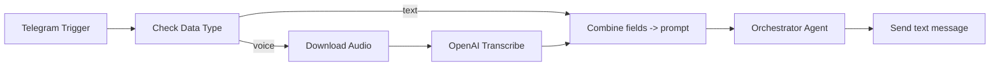
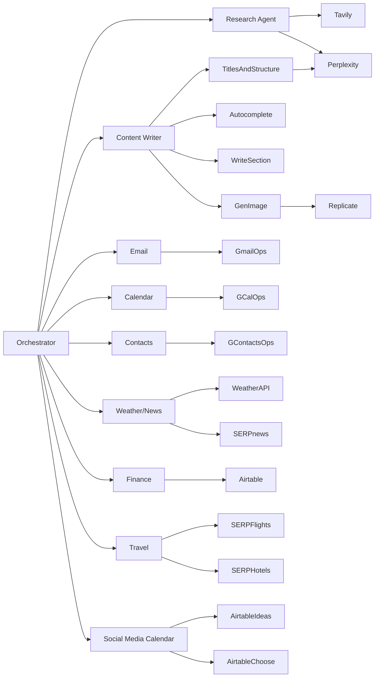

### Personal Assistant – Przewodnik Architektury i Modyfikacji

Ten dokument opisuje architekturę, przepływy danych, narzędzia i konfigurację Personal Assistant opartego na n8n. Konsoliduje workflow JSON i dostarczony diagram systemu w jedną referencję inżynierską, dzięki której możesz bezpiecznie modyfikować lub rozszerzać asystenta.

Uwaga: Wrażliwe identyfikatory i dane uwierzytelniające nie są tutaj reprodukowane. Przechowuj sekrety w skarbcu poświadczeń n8n.

## Przegląd wysokiego poziomu

- **Orkiestracja I/O**: Telegram jest głównym interfejsem. Wiadomości przechodzą przez sprawdzenie typu (tekst vs głos). Wiadomości głosowe są pobierane i transkrybowane. Tekst i transkrypcja są łączone w jeden `prompt`. `Agent Orkiestrator` decyduje, który agent/tool domenowy wywołać i odpowiada z powrotem do Telegram.
- **Pamięć**: Krótkie okno bufora czatu i pamięć czatu oparta na Postgres zapewniają kontekst sesji używając Telegram `chat.id` jako `sessionKey`.
- **Modele**: Dostępne są modele czatu Anthropic i OpenAI. Modele Perplexity są używane jako zaplecza badawcze. Modele są dołączone do konkretnych agentów/narzędzi przez połączenia AI n8n.
- **Agenci domenowi**: Badania, Tworzenie Treści, Email, Kalendarz, Kontakty, Pogoda/Wiadomości, Śledzenie Finansów, Podróże, Kalendarz Mediów Społecznościowych i Twórca/Raportowanie Dokumentów.

## Globalny przepływ danych

## Pamięć i modele

- `Simple Memory` (BufferWindow):
  - sesja: `={{ $('Telegram Trigger').item.json.message.chat.id }}`
  - okno kontekstu: 10 wiadomości
- `Postgres Chat Memory`:
  - sesja: `={{ $('Telegram Trigger').item.json.message.chat.id }}`
  - okno kontekstu: 7 wiadomości
- Dostępne modele czatu:
  - `Anthropic Chat Model` (np. Claude Sonnet)
  - `GPT-4.1`, `gpt-4.1-mini` (nazwany `GPT-5-Nano` w workflow)
  - Modele Perplexity: `sonar-pro`, `sonar-deep-research`

## Agent Orkiestrator

Cel: Centralny router, który odczytuje połączony `prompt`, stosuje kompleksową wiadomość systemową z instrukcjami dla każdej domeny i deleguje do odpowiedniego agenta/narzędzia.

Kluczowe zasady w wiadomości systemowej (skrócone):
- Pogoda i wiadomości: wywołaj agenta Pogody i Wiadomości. Wyjście pogody ograniczone do temperatury, indeksu ciepła/chłodu wiatru, opadów (+ wschód/zachód słońca na żądanie). Wiadomości: najnowsze nagłówki + krótkie podsumowanie.
- Podróże: użyj agenta Lotów/Hoteli. Domyślnie: ekonomiczna, w jedną stronę, największe lotniska miast, najmniej przesiadek.
- Email: pełne zarządzanie; potwierdź szkice przed wysłaniem; wyszukaj adresy przez Kontakty jeśli brakuje.
- Wydatki: użyj Śledzenia Finansów; format wejścia: waluta, kwota, typ; data jako ISO 8601.
- Głębokie badania: użyj agenta Badań (Tavily + Perplexity); eskaluj do głębokich badań jeśli wymagane.
- Kalendarz: zarządzaj spotkaniami przez agenta Kalendarza; rozwiąż kontakty przez agenta Kontaktów.
- Kalendarz mediów społecznościowych: pobierz pomysły przez Airtable i zaktualizuj wybrany framework i status.
- Pisanie treści: utwórz długi artykuł z badaniami i generowaniem obrazów, następnie utwórz Google Doc i zwróć URL udostępniania.

Wejścia:
- `prompt =` tekst Telegram + opcjonalna transkrypcja

Wyjścia:
- Końcowa odpowiedź tekstowa z powrotem do Telegram

Zależności:
- Połączony ze wszystkimi agentami/narzędziami domenowymi przez `connections`
- Używa obu węzłów pamięci dla kontekstu

## Wejście Telegram i przetwarzanie wstępne

- `Telegram Trigger`: przychodzące wiadomości i notatki głosowe
- `Check Data Type` (Switch): rozgałęzia na `message.text` vs `message.voice`
- `Download Audio`: pobiera plik głosowy Telegram przez `file_id`
- `OpenAI` (transkrypcja): konwertuje audio na tekst
- `Combine fields`: ustawia `prompt` jako "transkrypcja tekstu + tekst wiadomości"
- `Filter`: opcjonalny numeryczny filtr `chat.id`
- `Send a text message`: wyświetla `{{ $json.output }}` z orkiestrowanego agenta z powrotem do czatu

## Agent Pogody i Wiadomości

Opis: Lekki agent z dwoma narzędziami HTTP.

Narzędzia:
- `Weather` (WeatherAPI, prognoza): parametry zapytania `q`, `days`
- `SERPapi news`: parametr `q` (zapytanie wiadomości)

Model: `gpt-4.1-mini` dołączony przez `GPT-5-Nano`

Uwaga: URL pogody zawiera podwójny ukośnik `v1//forecast.json`; rozważ naprawę na `v1/forecast.json`.

## Asystent Badań

Opis: Agent do ogólnych i głębokich badań.

Narzędzia:
- `Tavily Research` (POST `https://api.tavily.com/search`)
  - wejścia `$fromAI`: `search_topic`
  - stałe parametry: depth, results, include_answer/raw itp.
- `Message a model in Perplexity` (`sonar-pro`)
- `In-Depth Research Tool` + `Message a model in Perplexity1` (`sonar-deep-research`)

Opcje agenta obejmują wiadomość systemową instruującą użycie Tavily i Perplexity, eskalując do głębokich badań gdy wymagane.

## Agent Tworzenia Treści

Opis: Wytwarza posty blogowe SEO z badaniami, obrazami i strukturą.

Główny agent: `Blog Post Writer` z iteracyjnym workflow:
1) Odbierz słowo kluczowe; 2) Wygeneruj tytuł/strukturę; 3) Wstęp; 4) Sekcje; 5) Wygeneruj obraz; 6) Skompiluj HTML; 7) Utwórz Google Doc i zwróć URL.

Narzędzia wspierające:
- `Titles and Structure Tool` (agent) →
  - `Perplexity Tool` (`sonar-pro`)
  - `Autocomplete Suggestions` (Google SERP API autocomplete)
- `Write Section Tool` (agent)
- `Generate Image Tool` (agent) →
  - `Generate Image` (Replicate `flux-schnell` predictions; JSON body z prompt, steps, itp.)
  - `Check Status` (sprawdź status predykcji przez URL)

Modele: Anthropic, OpenAI mini i Perplexity dołączone gdzie zdefiniowane w `connections`.

## Agent Email

Opis: Kompleksowe zarządzanie Gmail.

Operacje narzędzia Gmail (konfigurowalne przez AI przez `$fromAI`):
- `get`, `getAll(search)`, `reply`, `send`, `delete`, `addLabels`, `removeLabels`, `markAsRead`, `markAsUnread`

Kluczowe zmienne:
- `Message_ID`, `Search`, `Received_After`, `Received_Before`, `Sender`, `Label_Names_or_IDs`, `Message`, `To`, `Subject`, `BCC`, `CC`, `Attachment_Field_Name`

## Agent Kalendarza

Opis: Zarządzanie Google Calendar.

Operacje:
- `create`, `update`, `get`, `getMany`, `delete`

Kluczowe zmienne:
- `Event_ID`, `Use_Default_Reminders`, `Summary`, `Description`, `attendees[]`, `After`/`Before` granice czasowe

## Agent Kontaktów

Opis: Wyszukiwanie szczegółów kontaktowych przez Google Contacts.

Operacje:
- `get` (przez `Contact_ID` i `Fields`), `getMany` (z `Return_All`, `Use_Query`)

## Śledzenie Finansów

Opis: Dodaj/wyszukaj wydatki w Airtable.

Operacje:
- `Create Entry` i `Search Entries` (Airtable)

Kluczowe zmienne:
- `Expense`, `Amount`, `Category`, `Date` (ISO 8601 jako datetime, nie string)

## Agent Podróży

Opis: Znajdź loty i hotele używając SERP APIs na podstawie szczegółowej wiadomości systemowej, która definiuje szablony parametrów URL i domyślne wartości.

Narzędzia:
- `Check Flights` (SERP API Google Flights; placeholder `{params}`)
- `Check Hotels` (SERP API Google Hotels; placeholder `{params}`)

Oczekiwane parametry (tylko niepuste):
- Loty: `departure_id`, `arrival_id`, `outbound_date`, `return_date`, `adults`, `children`, `infants_on_lap`, `infants_in_seat`, `travel_class` (1–4)
- Hotele: `q`, `check_in_date`, `check_out_date`, `adults`, `children`, `children_ages`, `rating`, `hotel_class`

## Kalendarz Mediów Społecznościowych (Planer Treści)

Opis: Pobierz i zaktualizuj pomysły na treści w Airtable dla Instagram, LinkedIn, TikTok.

Odczyt:
- `Get Instagram Ideas`, `Get LinkedIn Ideas`, `Get Tiktok Ideas` z `filterByFormula` aby pominąć odrzucone/wygenerowane elementy.

Aktualizacja (Upsert przez URL):
- `Choose Instagram Idea`, `Choose LinkedIn Ideas`, `Choose Tiktok Idea` z kolumnami: `Selected Framework` (Framework 1/2/3), `Action` (Generate Content/Reject), dopasowanie na `URL`.

## Twórca i Raportowanie Dokumentów

Opis: Zarządzaj Google Docs dla wyjścia treści i raportowania.

Operacje:
- `Create a document` (przez `Title`)
- `Update a document` (wstaw tekst do `Doc_ID_or_URL`)
- `Get a document`

## Mapa połączeń (uproszczona)

## Referencja zmiennych `$fromAI(...)` (według domeny)

Ta sekcja wymienia zmienne konfigurowalne przez AI używane przez narzędzia. Użyj tych nazw podczas promptowania lub podłączania wejść węzłów.

- Badania: `search_topic`, `message0_Text`
- Tworzenie Treści: `search_query`, `keyword_as_searched_by_user`, `topic`, `style`, `URL`
- Finanse: `Expense`, `Amount`, `Category`, `Date`
- Pogoda/Wiadomości: `parameters0_Value` (zapytanie/lokalizacja), `parameters1_Value` (dni)
- Kalendarz: `Summary`, `Description`, `Location`, `attendees0_Attendees`, `Event_ID`, `Return_All`, `After`, `Before`, `Use_Default_Reminders`
- Kontakty: `Prompt__User_Message_`, `Contact_ID`, `Fields`, `Use_Query`, `Return_All`
- Email: `Message_ID`, `Label_Names_or_IDs`, `Search`, `Received_After`, `Received_Before`, `Sender`, `Message`, `To`, `Subject`, `BCC`, `CC`, `Attachment_Field_Name`
- Podróże: specyficzny dla narzędzia string `{params}` komponowany z pól wiadomości systemowej

Wskazówka: Wiele węzłów używa generycznego `Prompt__User_Message_` jako wejścia agenta; zachowaj format spójny między agentami.

## Playbooki modyfikacji

Dodaj nowe narzędzie do istniejącego agenta:
1. Utwórz węzeł narzędzia z zwięzłym `toolDescription`.
2. Podłącz wymagane wejścia `$fromAI(...)` z bezpiecznymi domyślnymi wartościami gdy odpowiednie.
3. Połącz narzędzie z docelowym agentem w `connections`.
4. Jeśli narzędzie wywołuje zewnętrzne API, utwórz dedykowane poświadczenie w n8n i odwołaj się do niego na węźle.
5. Zaktualizuj wiadomość systemową agenta aby opisać kiedy używać nowego narzędzia.

Dodaj nowego agenta domenowego:
1. Utwórz węzeł `agentTool` z jasną wiadomością systemową i wejściami.
2. Dołącz model czatu jeśli potrzebny (przez węzeł modelu językowego i `connections`).
3. Dodaj jeden lub więcej węzłów narzędzi, połącz je z agentem.
4. Połącz agenta z `Orchestrator Agent` i zaktualizuj jego politykę routingu wiadomości systemowej.

Dostosuj pamięć:
1. Dostraj `contextWindowLength` na węzeł pamięci.
2. Upewnij się, że `sessionKey` pozostaje `Telegram chat.id` chyba że dodano wsparcie wielokanałowe.

Obsługa błędów i długotrwałe zadania:
- Dla workflowów pollingowych (np. generowanie obrazów Replicate), zachowaj ograniczone ponowienie z backoff i końcowy timeout. Zwróć przyjazną dla użytkownika wiadomość na timeout.

Bezpieczeństwo i poświadczenia:
- Użyj poświadczeń n8n; nigdy nie hardkoduj sekretów.
- Redaguj PII w logach i wyjściach gdzie odpowiednie.

## Znane zastrzeżenia i uwagi jakościowe

- URL pogody ma `v1//forecast.json` – zmień na `v1/forecast.json` aby uniknąć 404s lub niespójności.
- Niektóre pola `$fromAI(...)` są luźno typowane; preferuj surowszą walidację na poziomie agenta.
- Rozważ limity szybkości dla SERP, WeatherAPI, Perplexity i Tavily; dodaj minimalne opóźnienia jeśli potrzebne.

## Referencja PDF (ai agent army in n8n.pdf)

**Status OCR**: Wiele prób wyodrębnienia tekstu z tego PDF było nieudanych z powodu ograniczeń technicznych:

1. **Początkowa ekstrakcja tekstu** używając `pdfminer.six` zwróciła pustą zawartość, wskazując że PDF nie ma warstwy tekstowej
2. **Próby OCR** używając Tesseract + Poppler nie powiodły się z powodu problemów środowiskowych PATH z binariami Poppler
3. **Ręczna konfiguracja OCR** była próbowana ale napotkała uporczywe problemy konfiguracji PATH

**Szczegóły techniczne**:
- Tesseract OCR jest zainstalowany i funkcjonalny
- Poppler jest zainstalowany przez winget ale niedostępny w PATH
- PDF wydaje się być oparty na obrazach (zeskanowany dokument) bez osadzonego tekstu
- Obecny wyodrębniony plik tekstowy `docs/pdf-ai-agent-army.txt` zawiera tylko znaki białe

**Rekomendacje**:
- Do natychmiastowego użycia: Dokumentacja architektury workflow poniżej jest kompletna i samodzielna
- Do przyszłego OCR: Rozważ ręczną konfigurację PATH lub alternatywne narzędzia OCR
- Do udostępniania dokumentów: Upewnij się, że PDFy zawierają warstwy tekstowe do wyboru gdy możliwe
- Analiza workflow Personal Assistant jest kompleksowa bez wymagania zawartości PDF

---

## Podsumowanie i następne kroki

Ten dokument zapewnia kompleksową analizę architektury workflow Personal Assistant n8n. Kluczowe dostarczenia:

### ✅ Ukończona analiza
- **Architektura Workflow**: Kompletne mapowanie wszystkich agentów, narzędzi i przepływów danych
- **Dokumentacja Agentów**: Szczegółowe opisy 10+ agentów domenowych z ich możliwościami
- **Integracja Narzędzi**: Kompleksowy katalog zewnętrznych APIs i usług
- **Przewodnik Modyfikacji**: Krok po kroku playbooki do rozszerzania systemu
- **Referencja Konfiguracji**: Kompletne mapowanie zmiennych `$fromAI(...)`

### 📋 Kluczowe ustalenia
- **Wzorzec Orkiestratora**: Centralny agent routingu z delegacją specyficzną dla domeny
- **Zarządzanie Pamięcią**: Podwójny system pamięci (Buffer + Postgres) dla retencji kontekstu
- **Wsparcie Multi-Modelowe**: Integracja modeli Anthropic, OpenAI i Perplexity
- **Rozległe Narzędzia**: 20+ integracji zewnętrznych w badaniach, produktywności i komunikacji

### 🔧 Architektura techniczna
- **Przetwarzanie Wejścia**: Interfejs oparty na Telegram z transkrypcją głosu
- **Orkiestracja Agentów**: Modułowy design z jasnym rozdzieleniem odpowiedzialności
- **Przepływ Danych**: Dobrze zdefiniowane połączenia i wzorce obsługi błędów
- **Skalowalność**: Łatwo dodawać nowych agentów i narzędzia następując ustalone wzorce

### 📚 Wytyczne użytkowania
Ten dokument służy jako kanoniczna referencja dla:
- Zrozumienia architektury workflow Personal Assistant
- Modyfikowania istniejących agentów i dodawania nowych możliwości
- Rozwiązywania problemów integracji
- Planowania rozszerzeń i ulepszeń systemu

Personal Assistant reprezentuje zaawansowany system orkiestracji AI, który może być rozszerzany i dostosowywany według konkretnych wymagań przy zachowaniu ustalonych wzorców architektonicznych.

